<div align="center">

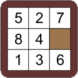

# N-Puzzle AI

### Phòng thí nghiệm Heuristic Search cho bài toán ghép tranh N-Puzzle

Chơi · Giải tự động · Trực quan hoá quá trình tìm kiếm · Kiểm định heuristic · Benchmark tái lập · Học máy

[](https://github.com/nguyentuanthien2384/n-puzzle/actions/workflows/ci.yml)


[Giới thiệu](#-giới-thiệu) ·
[Giao diện](#️-giao-diện) ·
[Bắt đầu nhanh](#-bắt-đầu-nhanh) ·
[Hướng dẫn](#-hướng-dẫn-sử-dụng) ·
[Thuật toán](#-thuật-toán) ·
[Heuristic](#-heuristic--kiểm-định) ·
[Kiến trúc](#️-kiến-trúc) ·
[CLI](#️-dòng-lệnh-cli) ·
[Thí nghiệm](#-thí-nghiệm-tái-lập)

<br>

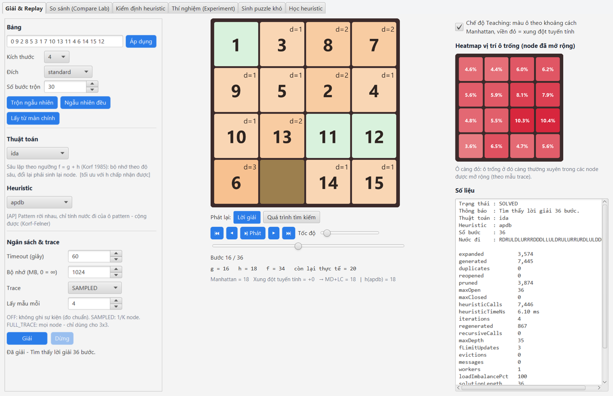

<sub>Search Lab: IDA\* + Pattern Database giải bảng 4x4 trong 36 bước — chế độ Teaching tô màu ô theo khoảng cách Manhattan, heatmap vị trí ô trống và đầy đủ số liệu tìm kiếm.</sub>

</div>

---

## 📖 Giới thiệu

**N-Puzzle AI** là đồ án môn **Trí tuệ nhân tạo** về bài toán ghép tranh N-Puzzle (3x3, 4x4, 5x5). Dự án bắt đầu là một trò chơi có nút "AI giải", rồi được phát triển thành một **nền tảng nghiên cứu và giảng dạy heuristic search** viết bằng **Java 17 + JavaFX + Maven**.

| 🎓 Học & dạy | 🔬 Nghiên cứu | 📊 Benchmark |
|---|---|---|
| Chơi thủ công, xem AI giải từng bước, **phát lại cả quá trình mở rộng node**, chế độ **Teaching** giải thích vì sao h có giá trị đó. | **Kiểm định vét cạn** heuristic trên toàn bộ 181.440 trạng thái 3x3, heuristic **mạng nơ-ron**, **sinh puzzle đối kháng**. | Thí nghiệm **tái lập được**: seed, checksum, manifest, CSV, biểu đồ; kiểm tra tính tối ưu tự động; CI trên GitHub Actions. |

Điểm cốt lõi về kiến trúc: **search engine độc lập với JavaFX**. Giao diện, dòng lệnh, benchmark và unit test đều gọi **cùng một mã nguồn thuật toán**, nên con số đo trong benchmark chính là thứ người dùng thấy trên giao diện.

## ✨ Tính năng nổi bật

<table>
<tr>
<td width="33%" valign="top">

**🧩 Trò chơi**
- Bảng 3x3 / 4x4 / 5x5, hai kiểu đích
- Chơi bằng chuột hoặc phím **W/A/S/D**
- Ghép bằng ô số hoặc **ảnh của bạn**
- Trộn bảng luôn có lời giải
- AI giải + phát lại từng bước

</td>
<td width="33%" valign="top">

**🧠 17 thuật toán**
- A\*, Weighted A\*, IDA\*, IDA\*-TT
- **RBFS**, **SMA\*** (giới hạn bộ nhớ)
- **HDA\*** song song đa nhân
- **Focal Search** + mạng nơ-ron
- BFS, Bi-BFS, Greedy, MCTS
- Value Iteration, Hill Climbing, SA, GA

</td>
<td width="33%" valign="top">

**📐 12 heuristic**
- Manhattan, Linear Conflict (LIS)
- Walking Distance
- **Pattern Database** cộng được, partition tuỳ chọn, lưu file `.pdb` có checksum
- Heuristic **học bằng mạng nơ-ron**
- Mỗi heuristic tự khai báo tính chất — và **được kiểm chứng**

</td>
</tr>
<tr>
<td valign="top">

**🔬 Search Lab (6 tab)**
- Giải & Replay (lời giải / quá trình tìm kiếm)
- Compare Lab
- Kiểm định heuristic
- Experiment Manager
- Sinh puzzle khó
- Học heuristic

</td>
<td valign="top">

**📊 Benchmark tái lập**
- Dataset có seed + checksum
- Warm-up, xáo thứ tự, executor riêng
- Đối chiếu h\* chính xác (3x3) hoặc **đồng thuận** giữa các thuật toán tối ưu (4x4)
- Xuất `manifest.json`, CSV, biểu đồ SVG

</td>
<td valign="top">

**⚙️ Kỹ thuật**
- `Board` bất biến, `Goal` tổng quát
- Ngân sách thời gian / node / bộ nhớ
- Plugin qua `ServiceLoader`
- CLI đầy đủ, JMH microbenchmark
- 161 unit test, CI + JaCoCo

</td>
</tr>
</table>

## 🖼️ Giao diện

### Màn hình chính

<div align="center">
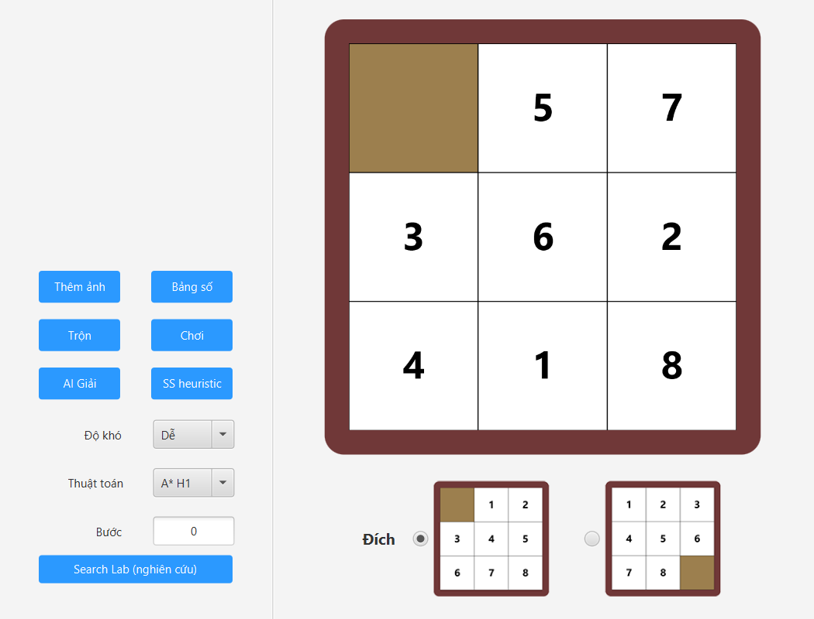
</div>

Màn hình trò chơi quen thuộc: chọn độ khó, kiểu đích, thuật toán và heuristic (menu **Thuật toán**), bấm **AI Giải** để giải hoặc **Chơi** để tự giải. Nút **Search Lab (nghiên cứu)** mở phòng thí nghiệm với đúng bảng đang chơi.

### Search Lab

<table>
<tr>
<td width="50%" align="center">
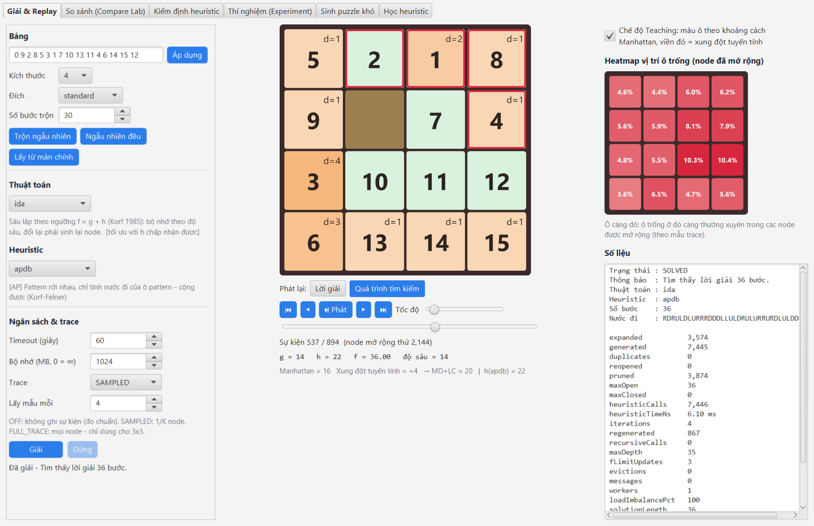<br>
<b>Search Replay</b><br>
<sub>Phát lại quá trình mở rộng node: g, h, f, độ sâu của từng node, viền đỏ là ô đang xung đột tuyến tính.</sub>
</td>
<td width="50%" align="center">
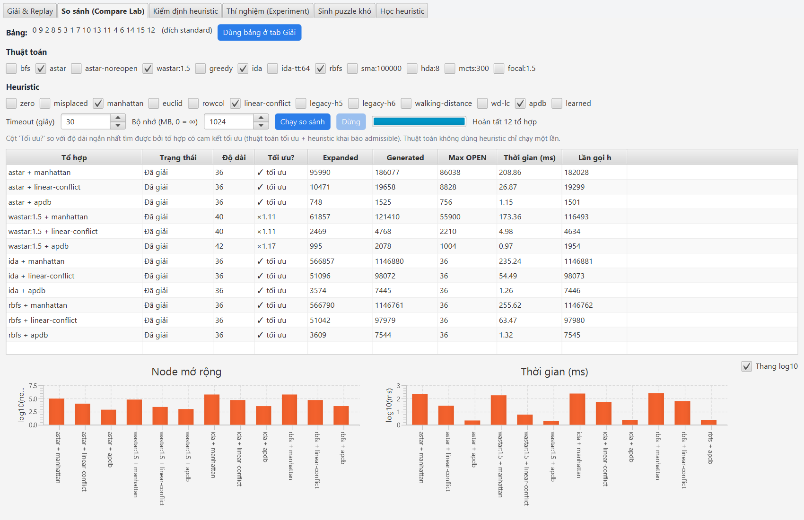<br>
<b>Compare Lab</b><br>
<sub>Nhiều tổ hợp thuật toán × heuristic trên cùng một bảng: số node, thời gian, độ dài và mức tối ưu.</sub>
</td>
</tr>
<tr>
<td align="center">
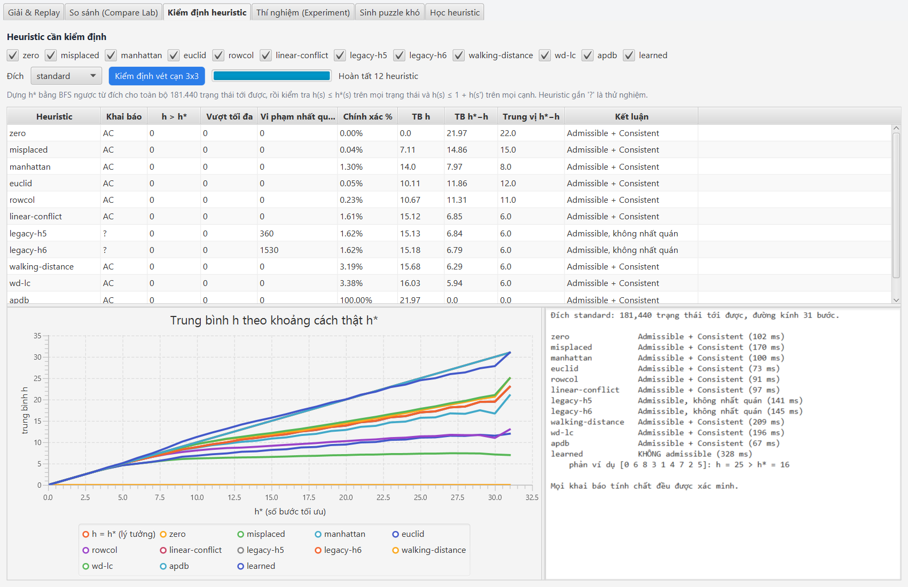<br>
<b>Kiểm định heuristic</b><br>
<sub>Vét cạn 181.440 trạng thái 3x3: vi phạm h ≤ h*, vi phạm nhất quán, phản ví dụ, đường cong h theo h*.</sub>
</td>
<td align="center">
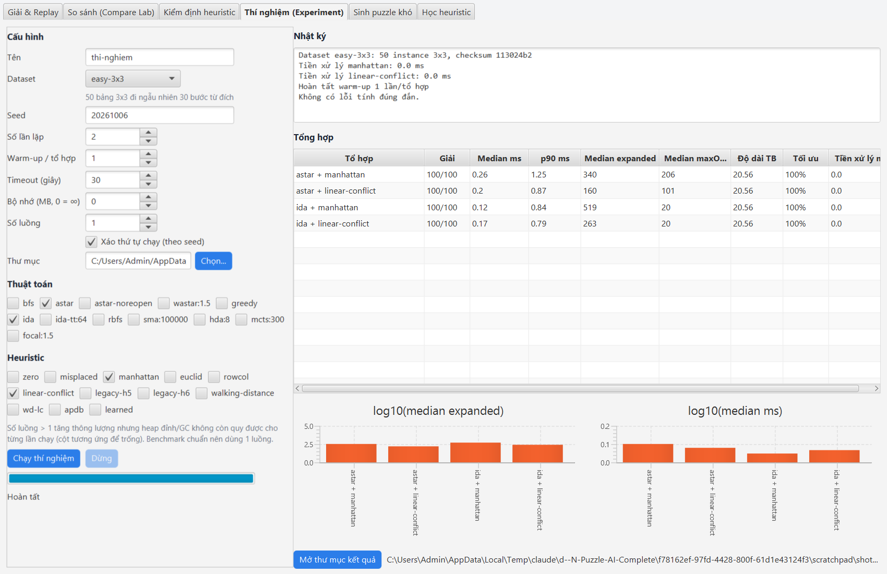<br>
<b>Experiment Manager</b><br>
<sub>Chạy thí nghiệm có seed, lặp, warm-up, đa luồng — xuất thư mục kết quả hoàn chỉnh.</sub>
</td>
</tr>
<tr>
<td align="center">
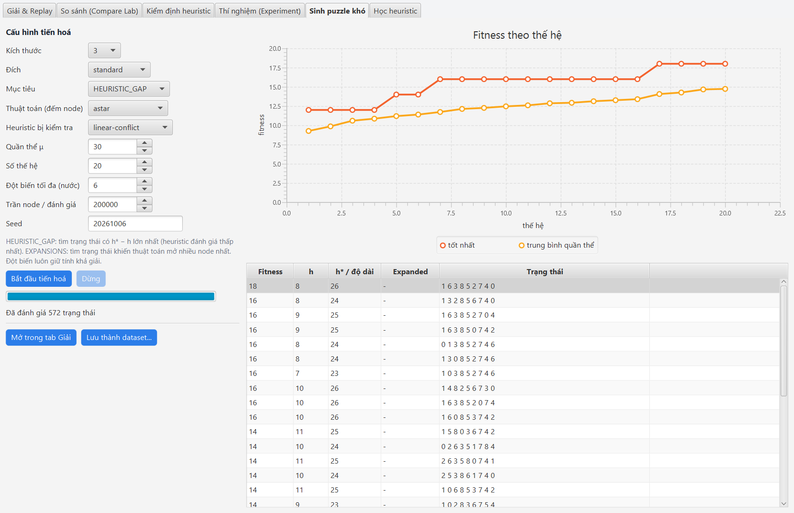<br>
<b>Sinh puzzle khó</b><br>
<sub>Tiến hoá tìm trạng thái làm heuristic đánh giá kém nhất (ở đây Linear Conflict thiếu tới 18 bước).</sub>
</td>
<td align="center">
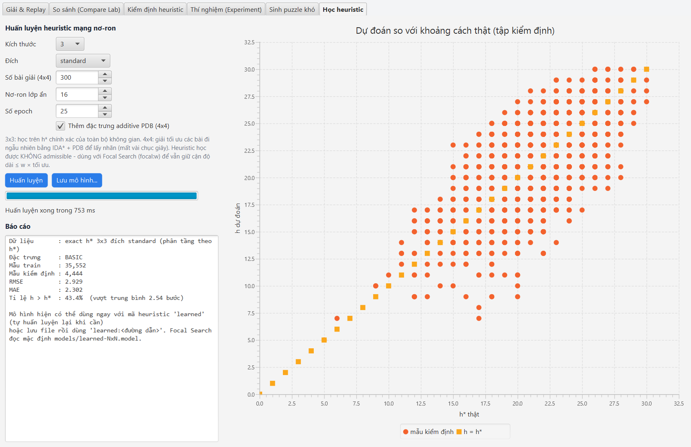<br>
<b>Học heuristic</b><br>
<sub>Huấn luyện mạng nơ-ron trên h* chính xác, biểu đồ dự đoán so với khoảng cách thật.</sub>
</td>
</tr>
</table>

## 🚀 Bắt đầu nhanh

### Yêu cầu

| Công cụ | Phiên bản | Kiểm tra |
|---|---|---|
| JDK | 17 trở lên | `java -version` |
| Apache Maven | 3.8 trở lên | `mvn -version` |
| IDE (tuỳ chọn) | IntelliJ IDEA / VS Code | — |

JavaFX được Maven tải tự động, không cần cài riêng.

### Chạy ứng dụng

```bash
git clone https://github.com/nguyentuanthien2384/n-puzzle.git
cd n-puzzle
mvn clean javafx:run
```

Trên Windows có thể bấm đúp `run.bat` (Linux/macOS: `./run.sh`).
Trong IntelliJ IDEA: mở thư mục dự án, chờ Maven tải dependency, rồi chạy Maven goal `javafx:run`.

### Chạy kiểm thử

```bash
mvn test        # 161 test, dưới một phút
mvn verify      # thêm báo cáo coverage JaCoCo tại target/site/jacoco/
```

Windows: `test.bat`.

### Dùng thử dòng lệnh

```bash
cli.bat solve --board 1,2,3,4,5,6,0,7,8 --algo ida --heuristic linear-conflict   # Linux/macOS: ./cli.sh ...
cli.bat verify                                                                  # kiểm định mọi heuristic
cli.bat benchmark --dataset random-15p --algos astar,ida,hda:4 --heuristics apdb
```

## 🎮 Hướng dẫn sử dụng

### Màn hình chính

| Điều khiển | Chức năng |
|---|---|
| **Độ khó** | Dễ (3x3), Trung bình (4x4), Khó (5x5) |
| **Đích** | Chọn một trong hai trạng thái đích (ô trống ở góc trên trái hoặc góc dưới phải) |
| **Trộn** | Trộn bảng bằng các nước đi hợp lệ từ đích — luôn có lời giải |
| **Chơi** | Bắt đầu tự chơi: bấm vào ô cạnh ô trống, hoặc dùng **W / A / S / D** để di chuyển ô trống |
| **Thêm ảnh / Bảng số** | Ghép bằng ảnh tuỳ chọn hoặc bằng ô số |
| **Thuật toán** | A\* với H1–H9, IDA\*, IDA\*-TT, RBFS, SMA\*, W-A\*, Greedy, Bi-BFS, Value Iteration, Hill Climbing, SA, GA. IDA\*, Greedy và các thuật toán mới dùng heuristic H1–H9 đang chọn |
| **AI Giải** | Giải trên luồng nền (tối đa 60 giây), hiện số node, số bước, thời gian; bấm **Chạy** để xem phát lại |
| **SS heuristic** | Chạy A\* với H1–H8 trên cùng bảng và xếp hạng theo số node |
| **Search Lab** | Mở phòng thí nghiệm với bảng và đích hiện tại |

### Search Lab

<details open>
<summary><b>1. Giải & Replay</b></summary>

1. Nhập bảng (ví dụ `1 2 3 4 5 6 0 7 8`), bấm **Trộn ngẫu nhiên**, **Ngẫu nhiên đều** hoặc **Lấy từ màn chính**.
2. Chọn thuật toán. Các ô tham số hiện theo thuật toán: trọng số *w* (W-A\*, Focal), số node (SMA\*), MB bảng chuyển vị (IDA\*-TT), số worker (HDA\*), số mô phỏng (MCTS).
3. Chọn heuristic — dòng mô tả cho biết khai báo `A` (admissible), `C` (consistent), `P` (cần tiền xử lý), `?` (thử nghiệm).
4. Đặt timeout, ngân sách bộ nhớ và chế độ trace: `OFF` (đo chuẩn), `SAMPLED` (1/K node), `FULL_TRACE` (mọi node — chỉ cho 3x3).
5. Bấm **Giải**: tiến độ cập nhật trực tiếp, có thể **Dừng** bất kỳ lúc nào mà vẫn giữ số liệu đã đo.
6. Phát lại **Lời giải** hoặc **Quá trình tìm kiếm** bằng ⏮ ◀ ⏯ ▶ ⏭, thanh tốc độ và timeline. Bật **Teaching** để xem khoảng cách Manhattan của từng ô và các ô xung đột tuyến tính.

</details>

<details>
<summary><b>2. Compare Lab</b></summary>

Tick các thuật toán và heuristic cần so sánh, đặt timeout/bộ nhớ chung, bấm **Chạy so sánh**. Các tổ hợp chạy tuần tự trên **cùng** bảng để không tranh CPU. Cột **Tối ưu?** so với độ dài ngắn nhất của các tổ hợp có cam kết tối ưu (✓ tối ưu hoặc ×1.17 ...). Bật **Thang log10** khi số node chênh nhau nhiều bậc.

</details>

<details>
<summary><b>3. Kiểm định heuristic</b></summary>

Chọn đích, tick heuristic, bấm **Kiểm định vét cạn 3x3**. Kết quả: số trạng thái có h > h\*, mức vượt tối đa, số cạnh vi phạm tính nhất quán, tỉ lệ h = h\*, sai số trung bình/trung vị, kết luận và phản ví dụ. Biểu đồ so sánh trung bình h theo từng h\* với đường lý tưởng h = h\*.

</details>

<details>
<summary><b>4. Thí nghiệm (Experiment Manager)</b></summary>

Chọn dataset dựng sẵn, seed, thuật toán, heuristic, số lần lặp, warm-up, timeout, bộ nhớ, số luồng và thư mục kết quả rồi bấm **Chạy thí nghiệm**. Khi xong: bảng tổng hợp, biểu đồ và nút **Mở thư mục kết quả** (chứa `manifest.json`, `raw-results.csv`, `summary.csv`, `charts/*.svg`).

</details>

<details>
<summary><b>5. Sinh puzzle khó</b></summary>

Chọn mục tiêu **HEURISTIC_GAP** (tìm trạng thái có h\* − h lớn nhất) hoặc **EXPANSIONS** (tìm trạng thái khiến thuật toán mở nhiều node nhất), cấu hình quần thể/thế hệ và bấm **Bắt đầu tiến hoá**. Chọn một dòng rồi **Mở trong tab Giải**, hoặc **Lưu thành dataset** để benchmark.

</details>

<details>
<summary><b>6. Học heuristic</b></summary>

Chọn kích thước (3x3 học trên h\* chính xác, 4x4 học từ lời giải tối ưu của IDA\* + PDB), số nơ-ron, số epoch, bấm **Huấn luyện**. Xem RMSE, MAE, tỉ lệ đánh giá vượt h\* và biểu đồ dự đoán. **Lưu mô hình** để dùng lại qua `learned:<đường dẫn>` hoặc Focal Search.

</details>

## 🧠 Thuật toán

| Nhóm | Thuật toán | Mã | Tối ưu | Bộ nhớ | Ghi chú |
|---|---|---|:---:|---|---|
| Mù | BFS | `bfs` | ✔ | Hàm mũ | Baseline, tới 4x4 |
| | Bidirectional BFS | *(màn hình chính)* | ✔ | Hàm mũ, ~căn bậc hai | Hai phía gặp nhau ở giữa |
| Heuristic tối ưu | A\* | `astar` | ✔ | OPEN + CLOSED | Reopen và tie-break cấu hình được |
| | A\* không reopen | `astar-noreopen` | ✔ nếu h nhất quán | OPEN + CLOSED | Để thí nghiệm chính sách reopen |
| | IDA\* | `ida` | ✔ | Tuyến tính | Korf 1985 |
| | IDA\*-TT | `ida-tt:MB` | ✔ | Tuyến tính + bảng cố định | Bảng chuyển vị cắt trạng thái trùng |
| | RBFS | `rbfs` | ✔ | Tuyến tính | Korf 1993, f-limit + giá trị backup |
| | SMA\* | `sma:N` | ✔ nếu N > độ sâu | ≤ N node | Loại lá tệ nhất khi đầy |
| | HDA\* | `hda:N` | ✔ | Chia cho N worker | A\* song song, phân trạng thái theo hash |
| Bounded-suboptimal | Weighted A\* | `wastar:w` | ≤ w × tối ưu | OPEN + CLOSED | "Fast solve mode" |
| | Focal Search | `focal:w` | ≤ w × tối ưu | OPEN + CLOSED | Thứ tự theo mạng nơ-ron, cận theo h admissible |
| Không tối ưu | Greedy Best-First | `greedy` | ✘ | OPEN + CLOSED | Chỉ xét h |
| | MCTS/UCT | `mcts:N` | ✘ | Cây mô phỏng | Baseline so sánh paradigm |
| MDP | Value Iteration | *(màn hình chính)* | ✔ | 9! trạng thái | Chỉ 3x3 |
| Tìm kiếm cục bộ | Hill Climbing, Simulated Annealing, Genetic Algorithm | *(màn hình chính)* | ✘ | Nhỏ | Chỉ 3x3; có thể thất bại — đúng bản chất nhóm thuật toán |

Mã thuật toán dùng chung cho Search Lab, CLI và benchmark; tham số đi sau dấu `:`, ví dụ `wastar:2.5`, `sma:50000`, `hda:4`, `focal:1.5`.

## 📐 Heuristic & kiểm định

| Mã | Heuristic | Khai báo | Ghi chú |
|---|---|:---:|---|
| `misplaced` | H1 — số ô sai vị trí | A C | Yếu nhất, làm mốc so sánh |
| `manhattan` | H2 — Manhattan | A C | Chuẩn mực |
| `euclid` | H3 — Euclid (phần nguyên) | A C | |
| `rowcol` | H4 — sai hàng + sai cột | A C | |
| `legacy-h5` | H5 — MD + xung đột tuyến tính (báo cáo gốc) | ? | Thử nghiệm |
| `legacy-h6` | H6 — H5 + ô bị chặn (báo cáo gốc) | ? | Thử nghiệm |
| `walking-distance` | H7 — Walking Distance (Takahashi) | A C P | 3x3, 4x4 |
| `wd-lc` | H8 — max(MD + LC chuẩn, WD) | A C P | |
| `apdb` | H9 — Pattern Database cộng được | A P | 3x3: chính xác; 4x4: 5-5-5; 5x5: 6×4 |
| `linear-conflict` | Manhattan + Linear Conflict chuẩn (LIS) | A C | Không đếm trùng xung đột |
| `apdb:…`, `pdb:…` | PDB với partition tuỳ chọn | A P | Ví dụ `apdb:4x4@1,2,5,6,9;3,4,7,8,11;10,12,13,14,15` |
| `learned` | Mạng nơ-ron (MLP) | P ? | Không admissible — dùng với Focal Search |
| `zero` | h = 0 | A C | A\* thành uniform-cost search |

<sub>A = admissible (không đánh giá vượt), C = consistent (nhất quán), P = cần tiền xử lý, ? = thử nghiệm.</sub>

**Khai báo không phải bằng chứng.** Bộ kiểm định dựng khoảng cách tối ưu thật h\* cho toàn bộ 181.440 trạng thái 3x3 bằng BFS ngược, rồi kiểm tra h ≤ h\* trên mọi trạng thái và h(s) ≤ 1 + h(s') trên mọi cạnh. Kết quả với đích chuẩn:

| Heuristic | h > h\* | Cạnh vi phạm nhất quán | h = h\* | TB h | TB (h\* − h) |
|---|---:|---:|---:|---:|---:|
| misplaced | 0 | 0 | 0,04% | 7,11 | 14,86 |
| manhattan | 0 | 0 | 1,30% | 14,00 | 7,97 |
| linear-conflict | 0 | 0 | 1,61% | 15,12 | 6,85 |
| **legacy-h5** | 0 | **360** | 1,62% | 15,13 | 6,84 |
| **legacy-h6** | 0 | **1.530** | 1,62% | 15,18 | 6,79 |
| walking-distance | 0 | 0 | 3,19% | 15,68 | 6,29 |
| wd-lc | 0 | 0 | 3,38% | 16,03 | 5,94 |
| apdb | 0 | 0 | 100% | 21,97 | 0,00 |

> [!IMPORTANT]
> **H5/H6 của báo cáo gốc vẫn admissible trên 3x3 nhưng không nhất quán.** Hệ quả: A\* không mở lại node có thể mất tính tối ưu với hai heuristic này. Vì vậy chúng được gắn nhãn *thử nghiệm*. Kiểm định này chạy lại trong mỗi lần `mvn test`.

## 🏗️ Kiến trúc

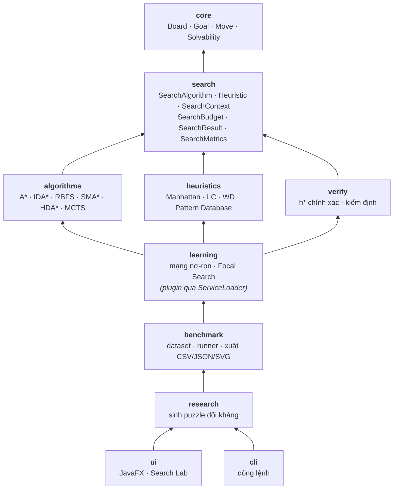

Phụ thuộc giữa các gói **một chiều, không có vòng**. Gói `learning` cần solver để gán nhãn, nhưng `heuristics`/`algorithms` không gọi ngược vào nó: nó tự đăng ký qua `ServiceLoader` như một plugin. Nhờ vậy các gói tách được thành Maven module mà không phải sửa code.

<details>
<summary><b>Search API — hợp đồng chung cho mọi thuật toán</b></summary>

```java
public interface SearchAlgorithm {
    String id();                       // "astar", "wastar:2.0", "sma:50000", "hda:4"
    AlgorithmProperties properties();  // dùng heuristic? tối ưu? bộ nhớ tuyến tính?
    SearchResult solve(PuzzleProblem problem, Heuristic heuristic,
                       SearchBudget budget, SearchObserver observer);
}

public interface Heuristic {
    String id();
    int estimate(Board board, Goal goal);
    default HeuristicProperties properties() { return HeuristicProperties.unknown(); }
    default void prepare(Goal goal) {}   // dựng/nạp PDB, mô hình — đo riêng
}
```

- `SearchBudget(timeoutMillis, maxExpandedNodes, maxMemoryBytes)` — 0 là không giới hạn.
- `SearchContext` đo mọi thuật toán theo **cùng một định nghĩa**: `expanded`, `generated`, `duplicates`, `reopened`, `pruned`, `maxOpen`, `heuristicCalls`, `iterations`, `regenerated`, `evictions`, `messages`, `wallTimeNs`, `cpuTimeNs`…
- `SearchObserver.traceMode()`: `OFF` không tạo sự kiện nào, nên benchmark không bị việc trực quan hoá làm sai lệch thời gian.

</details>

## ⌨️ Dòng lệnh (CLI)

Chạy bằng `cli.bat <lệnh>` (Windows), `./cli.sh <lệnh>` (Linux/macOS) hoặc `mvn -q compile exec:java -Dexec.args="<lệnh>"`.

| Lệnh | Mục đích |
|---|---|
| `list` | Liệt kê thuật toán, heuristic (kèm khai báo tính chất) và dataset |
| `solve` | Giải một bảng, in số liệu và lời giải; 3x3 so với độ dài tối ưu chính xác |
| `verify` | Kiểm định vét cạn heuristic trên 3x3, xuất CSV |
| `benchmark` | Chạy thí nghiệm và xuất thư mục kết quả |
| `dataset` | Xuất dataset dựng sẵn ra file văn bản |
| `build-pdb` | Dựng và lưu Pattern Database |
| `train-heuristic` | Huấn luyện heuristic mạng nơ-ron |
| `adversarial` | Sinh puzzle đối kháng, xuất dataset |
| `plugins` | Nạp JAR plugin từ thư mục |

<details>
<summary><b>Ví dụ đầy đủ</b></summary>

```bash
# Giải
cli solve --board 1,2,3,4,5,6,0,7,8 --algo ida --heuristic linear-conflict
cli solve --random 4 --steps 60 --seed 7 --algo hda:4 --heuristic apdb --show-path

# Kiểm định heuristic
cli verify --goal blank-first --csv verify.csv

# Thí nghiệm
cli benchmark --dataset random-15p --algos astar,ida,rbfs,hda:4,focal:2,wastar:2 \
              --heuristics linear-conflict,apdb --reps 3 --timeout 60 --max-mem-mb 1024

# Pattern Database, học máy, puzzle đối kháng
cli build-pdb --size 4 --partition "1,2,5,6,9;3,4,7,8,11;10,12,13,14,15"
cli train-heuristic --size 4 --instances 400 --out models/learned-4x4.model
cli adversarial --size 4 --objective expansions --algo ida --heuristic linear-conflict --out hard.txt
cli benchmark --dataset file:hard.txt --algos ida,rbfs --heuristics linear-conflict,apdb
```

Trên Windows nên viết bảng bằng dấu phẩy (`1,2,3,...`) để tránh lỗi dấu ngoặc kép khi truyền qua Maven.

</details>

## 🔬 Thí nghiệm tái lập

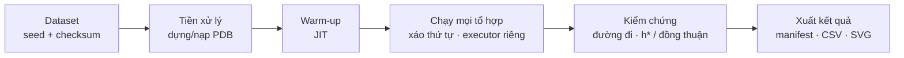

Mỗi thí nghiệm tạo một thư mục tự mô tả, đủ để người khác clone repo và tái tạo:

```text
experiments/2026-10-07-093007-readme-15p/
├── manifest.json       cấu hình, seed, checksum dataset/PDB, Git commit, JDK, JVM args
├── environment.json    OS, CPU, RAM, phiên bản dependency
├── puzzles.json        các bảng + độ dài tối ưu
├── dataset.txt         nạp lại bằng --dataset file:...
├── raw-results.csv     từng lần chạy với đầy đủ số liệu
├── summary.csv         trung vị, p10/p90, tỉ lệ giải, tỉ lệ tối ưu, optimality gap
├── charts/*.svg        biểu đồ dùng ngay cho báo cáo
└── logs/run.log
```

Với 3x3, kết quả được đối chiếu với h\* chính xác. Với 4x4 trở lên không có đáp án chính xác, nên runner dùng **kiểm tra đồng thuận**: độ dài ngắn nhất của các tổ hợp có cam kết tối ưu làm tham chiếu. Nếu hai thuật toán "tối ưu" cho độ dài khác nhau, đó là lỗi và sẽ được báo.

### Kết quả mẫu — `random-15p` (40 bảng 4x4)

<sub>Một lần chạy trên Intel Core thế hệ 7, JDK 21, timeout 10 s — chỉ để minh hoạ xu hướng, không phải số liệu công bố.</sub>

| Tổ hợp | Giải | Median node | Median ms | Độ dài TB | Gap TB |
|---|:---:|---:|---:|---:|---:|
| A\* + linear-conflict | 40/40 | 13.585 | 26,8 | 37,20 | 1,00 |
| A\* + apdb | 40/40 | 4.146 | 4,8 | 37,20 | 1,00 |
| IDA\* + linear-conflict | 40/40 | 46.804 | 47,0 | 37,20 | 1,00 |
| IDA\* + apdb | 40/40 | 7.050 | 2,8 | 37,20 | 1,00 |
| IDA\*-TT 64 MB + apdb | 40/40 | 5.846 | 10,0 | 37,20 | 1,00 |
| RBFS + apdb | 40/40 | 10.418 | 3,2 | 37,20 | 1,00 |
| SMA\* 500k node + apdb | 40/40 | 6.614 | 24,1 | 37,20 | 1,00 |
| HDA\* 4 worker + apdb | 40/40 | 9.250 | 10,9 | 37,20 | 1,00 |
| W-A\* (w=2) + apdb | 40/40 | 418 | 0,5 | 44,25 | 1,19 |
| Focal (w=2, mạng nơ-ron) + apdb | 40/40 | 256 | 2,3 | 54,25 | 1,46 |
| MCTS 200 mô phỏng + apdb | 40/40 | 400 | 8,4 | 60,05 | 1,62 |

Một số nhận xét rút ra từ bảng:

- **PDB thắng rõ rệt**: A\* + PDB mở ít hơn Linear Conflict khoảng 3 lần; với IDA\* là gần 7 lần.
- **Ít node không đồng nghĩa nhanh hơn**: IDA\*-TT mở ít node hơn IDA\* nhưng chậm hơn, vì chi phí tra bảng chuyển vị.
- **Đánh đổi độ dài lấy tốc độ**: W-A\* và Focal mở ít node hơn hàng chục lần; đổi lại lời giải dài hơn, nhưng vẫn nằm trong cận w × tối ưu.
- **MCTS** giải được nhưng lời giải dài: phù hợp vai trò baseline so sánh paradigm, không phải solver tối ưu.

## 🤖 Nghiên cứu nâng cao

<details>
<summary><b>Heuristic mạng nơ-ron + Focal Search</b></summary>

- **Pipeline**: trạng thái đã giải → (đặc trưng, khoảng cách còn lại) → mạng nơ-ron → `LearnedHeuristic` → Focal Search → so sánh với PDB.
- **Mô hình**: MLP một lớp ẩn ReLU, Adam, viết bằng Java thuần nên solver vẫn chạy thuần JVM. Mạng học **phần dư so với Manhattan**, có **cân bằng mẫu theo h\*** để dự đoán bám sát cả vùng gần đích.
- **Mô hình có sẵn** trong `models/`:
  - 3x3: MAE ≈ 2,3 bước, vượt h\* ở khoảng 43% trạng thái.
  - 4x4: MAE ≈ 1,2 bước, vượt h\* ở khoảng 30% trạng thái.
- **Dùng an toàn**: không đưa h học được vào A\* rồi gọi kết quả là tối ưu. Focal Search giữ OPEN theo f = g + h với **h admissible đã kiểm định** (PDB); mạng nơ-ron chỉ chọn thứ tự mở rộng trong FOCAL. Nhờ vậy lời giải luôn ≤ w × tối ưu.

</details>

<details>
<summary><b>HDA* — tìm kiếm song song</b></summary>

Mỗi trạng thái thuộc về đúng một worker theo hash. Successor được gửi tới worker sở hữu qua hàng đợi tin nhắn, và các worker chạy theo vòng đồng bộ. Thuật toán dừng khi không còn tin đang truyền và mọi OPEN có f ≥ lời giải tốt nhất — điều kiện này bảo đảm tối ưu. Số liệu riêng: `messages` (trạng thái chuyển giữa worker), `loadImbalancePct` (mất cân bằng tải). Đây là proof-of-concept trên đa nhân trong một tiến trình.

</details>

<details>
<summary><b>Sinh puzzle đối kháng</b></summary>

Tiến hoá (μ+λ) với đột biến luôn giữ khả giải. Mục tiêu `gap` tìm trạng thái có h\* − h lớn nhất; mục tiêu `expansions` tìm trạng thái làm solver mở nhiều node nhất. Kết quả xuất thành dataset để benchmark — minh hoạ rằng **benchmark trung bình là chưa đủ**.

</details>

## ✅ Kiểm thử & CI

| Bộ test | Kiểm tra |
|---|---|
| `core/` | Board bất biến, khoá nén đơn ánh; khả giải khớp BFS vét cạn và đích tuỳ ý tới 6x6 |
| `verify/` | Oracle h\*: 181.440 trạng thái, đường kính 31 |
| `heuristics/` | Kiểm định vét cạn mọi heuristic × 3 kiểu đích; PDB: chỉ số song ánh, cộng được, checksum file |
| `algorithms/` | Mọi thuật toán tối ưu × heuristic admissible = h\* trên bộ golden; HDA\* 1/2/4/8 worker; SMA\* loại node mà vẫn tối ưu; ngân sách, hủy, trace; MCTS |
| `learning/`, `research/` | Mạng nơ-ron chính xác hơn Manhattan; Focal giữ cận w × tối ưu; tiến hoá giữ khả giải và tất định theo seed |
| `benchmark/`, `cli/` | Thư mục thí nghiệm đầy đủ, song song = tuần tự, kiểm tra đồng thuận 4x4, mọi lệnh CLI |
| Bộ test v2 | `StateTest`, `SearchTest`, `AdvancedSearchTest` của các thuật toán ở màn hình chính |

**GitHub Actions**:
- [`ci.yml`](.github/workflows/ci.yml): mỗi push/PR chạy `mvn verify` (test + JaCoCo), một benchmark nhỏ trên 3x3 đối chiếu h\*, và một benchmark đồng thuận trên 4x4.
- [`nightly-benchmark.yml`](.github/workflows/nightly-benchmark.yml): benchmark đầy đủ hằng đêm hoặc chạy thủ công.

## 📁 Cấu trúc thư mục

```text
n-puzzle/
├── pom.xml                       Maven: Java 17, JavaFX, JUnit 5, JaCoCo, exec (CLI)
├── run.bat · run.sh              Chạy ứng dụng
├── cli.bat · cli.sh              Chạy dòng lệnh
├── test.bat                      Chạy test
├── .github/workflows/            CI và benchmark hằng đêm
├── benchmarks-jmh/               Microbenchmark JMH (dự án Maven riêng)
├── models/                       Mô hình heuristic mạng nơ-ron (3x3, 4x4)
├── docs/
│   ├── RESEARCH_PLATFORM.md      Tài liệu kỹ thuật chi tiết
│   └── images/                   Ảnh giao diện
└── src/
    ├── main/java/com/example/npuzzleai/
    │   ├── core/                 Board, Goal, Move, Solvability, BoardGenerator
    │   ├── search/               Search API + SearchContext (instrumentation)
    │   ├── algorithms/           A*, W-A*, IDA*(-TT), RBFS, SMA*, HDA*, MCTS, BFS, Greedy
    │   ├── heuristics/           Manhattan, LC, WD, H5/H6 gốc · pdb/ Pattern Database
    │   ├── verify/               Bảng h* chính xác, kiểm định heuristic
    │   ├── learning/             Mạng nơ-ron, huấn luyện, Focal Search
    │   ├── benchmark/            Dataset, ExperimentRunner, xuất CSV/JSON/SVG
    │   ├── research/             Sinh puzzle đối kháng
    │   ├── cli/                  Dòng lệnh
    │   ├── ui/                   Search Lab (6 tab)
    │   └── *.java                Ứng dụng JavaFX và các thuật toán v2 (màn hình chính)
    ├── main/resources/           FXML, CSS, ảnh, META-INF/services
    └── test/java/                161 unit test
```

## ⚡ Hiệu năng & lưu ý

- **BFS** tốn bộ nhớ theo hàm mũ, chỉ nên dùng cho 3x3. Với 4x4/5x5 nên dùng **IDA\* + apdb** hoặc **A\* + apdb**.
- **Pattern Database** dựng một lần rồi lưu vào `pdb-cache/`: 4x4 khoảng 5 giây, 5x5 khoảng 10–30 giây; những lần sau nạp trong vài chục mili giây.
- **Ngân sách bộ nhớ** trong ứng dụng là ước lượng theo số node; để giới hạn RAM thật, đặt `-Xmx` (ví dụ `MAVEN_OPTS=-Xmx2g`).
- **Tìm kiếm cục bộ** (Hill Climbing, SA, GA) có thể thất bại hoặc cho lời giải dài — đó là bản chất của nhóm thuật toán này, hữu ích để minh hoạ trong báo cáo.
- Bảng do nút **Trộn** tạo luôn có lời giải; mọi thuật toán kiểm tra khả giải trước khi tìm kiếm.

## 🧩 Mở rộng bằng plugin

Viết lớp cài đặt `SearchAlgorithm` hoặc `Heuristic`, khai báo trong `META-INF/services/…`, đóng gói JAR, đặt vào `plugins/` rồi chạy `cli plugins --dir plugins`. Plugin dùng `SearchContext` được đo bằng đúng các số liệu như thuật toán có sẵn.

```java
public final class MyHeuristic implements Heuristic {
    public String id() { return "my-h"; }
    public int estimate(Board b, Goal g) { return BasicHeuristics.manhattan(b, g); }
    public HeuristicProperties properties() { return HeuristicProperties.admissibleAndConsistent("..."); }
}
```

## 🗺️ Lịch sử phát triển

<details>
<summary><b>v3.0 — Research & Teaching Platform</b></summary>

- Search engine độc lập JavaFX; `Goal` tổng quát và kiểm tra khả giải cho đích bất kỳ.
- Thuật toán mới: Weighted A\*, IDA\*-TT, RBFS, SMA\*, HDA\*, Focal Search, MCTS.
- Pattern Database tổng quát (partition tuỳ chọn, metadata, checksum, file `.pdb`).
- Kiểm định heuristic vét cạn 3x3; phát hiện H5/H6 không nhất quán.
- Heuristic mạng nơ-ron; sinh puzzle đối kháng.
- Benchmark tái lập với kiểm tra tối ưu tự động; CLI; Search Lab 6 tab; CI + JaCoCo; JMH.

</details>

<details>
<summary><b>v2.0 — Thuật toán & heuristic chuyên sâu</b></summary>

- Thêm IDA\*, Greedy Best-First, Bidirectional BFS, Value Iteration, Hill Climbing, Simulated Annealing, Genetic Algorithm.
- Thêm heuristic Walking Distance (H7), max(MD + LC chuẩn, WD) (H8), Pattern Database (H9).
- Sửa ba lỗi tinh vi: hạng Lehmer, bảng WD với đích ô trống ở góc trên, mã hoá trong BFS của PDB.

</details>

<details>
<summary><b>v1.1 — Hoàn thiện source gốc</b></summary>

- BFS dùng tập visited; A\* dùng `PriorityQueue` + bestG và mở lại node khi có đường tốt hơn.
- Sửa heuristic 2–6 dùng `Arrays.binarySearch` trên mảng chưa sắp xếp (tính sai với đích thứ hai).
- Thêm kiểm tra khả giải; sửa lỗi đồng bộ khi bấm phím khác W/A/S/D.
- Phát lại lời giải qua JavaFX Application Thread; so sánh heuristic giữ lại lời giải tốt nhất.
- Cập nhật Maven/JavaFX lên cấu hình Java 17 ổn định; bổ sung unit test.

</details>

Chi tiết từng phiên bản: [HOAN_THIEN_DU_AN.md](HOAN_THIEN_DU_AN.md).

## 📚 Tài liệu

- [docs/RESEARCH_PLATFORM.md](docs/RESEARCH_PLATFORM.md) — tài liệu kỹ thuật đầy đủ: kiến trúc, metrics, quy trình thí nghiệm, đối chiếu lộ trình.
- [HOAN_THIEN_DU_AN.md](HOAN_THIEN_DU_AN.md) — ghi chú hoàn thiện qua từng phiên bản.
- *Hướng phát triển chuyên sâu cho dự án N-Puzzle Java 17 + Maven + JavaFX* (PDF ở thư mục gốc) — lộ trình phát triển.

<details>
<summary><b>Tài liệu tham khảo khoa học</b></summary>

- P. E. Hart, N. J. Nilsson, B. Raphael — *A Formal Basis for the Heuristic Determination of Minimum Cost Paths* (1968) — A\*.
- R. E. Korf — *Depth-first Iterative-Deepening: An Optimal Admissible Tree Search* (1985) — IDA\*.
- R. E. Korf — *Linear-Space Best-First Search* (1993) — RBFS.
- S. Russell — *Efficient Memory-Bounded Search Methods* (1992) — SMA\*.
- O. Hansson, A. Mayer, M. Yung — *Criticizing Solutions to Relaxed Models Yields Powerful Admissible Heuristics* (1992) — Linear Conflict.
- J. Culberson, J. Schaeffer — *Pattern Databases* (1998).
- R. E. Korf, A. Felner — *Disjoint Pattern Database Heuristics* (2002).
- A. Felner, R. E. Korf, S. Hanan — *Additive Pattern Database Heuristics* (2004).
- A. Kishimoto, A. Fukunaga, A. Botea — *Scalable, Parallel Best-First Search for Optimal Sequential Planning* (2009) — HDA\*.
- J. Pearl, J. H. Kim — *Studies in Semi-Admissible Heuristics* (1982) — Focal Search.
- L. Kocsis, C. Szepesvári — *Bandit Based Monte-Carlo Planning* (2006) — UCT.
- F. Agostinelli và cộng sự — *Solving the Rubik's Cube with Deep Reinforcement Learning and Search* (2019) — DeepCubeA.
- K. Takahashi — Walking Distance heuristic cho 15-puzzle.

</details>

---

<div align="center">
<sub>Đồ án môn Trí tuệ nhân tạo · Java 17 · JavaFX · Maven</sub>
</div>
